# Architecture du projet `pricetracker` (mise à jour)

Diagramme Mermaid reprenant l'architecture convenue : médaillon (Bronze / Silver / Gold), GCP BigQuery, Cloud Scheduler / Cloud Run, KPIs et sorties modèles (OCR, indices, anomalies).

```mermaid
flowchart LR
  subgraph PRICETRACKER[pricetracker/]
    direction TB
    ingestion["ingestion/"]
    raw["raw/ (bronze)"]
    medallion["medallion/ (bronze -> silver -> gold)"]
    transform["transform/ (dbt vers BigQuery)"]
    orchestration["orchestration/ (Cloud Scheduler / Cloud Run)"]
    serving["serving/ (FastAPI)"]
    docs["docs/"]
  end

  %% ingestion
  ingestion --> |upload| raw
  ingestion --> |OCR, HF| medallion

  %% medallion flow
  raw --> bronze["Bronze: raw Parquet / GCS"]
  bronze --> silver["Silver: open_prices_clean, catalogue_produits (BigQuery - dataset: silver)"]
  silver --> gold["Gold: indices_inflation, aggregats_enseignes, rankings_produits, anomalies_detected (dataset: gold)"]

  %% transform (dbt -> BigQuery)
  transform --> |dbt models BigQuery| silver
  transform --> |aggregations| gold

  %% orchestration
  orchestration --> |scheduler| ingestion
  orchestration --> |scheduler| transform

  %% serving
  serving --> |API endpoints| gold
  serving --> |KPIs & exports| docs

  %% KPIs / modèles
  subgraph KPIS[KPIs & Model Outputs]
    direction TB
    ocr_results["OCR outputs / quality metrics -> silver / gold"]
    indices["Inflation indices (Laspeyres) -> gold/indices_inflation"]
    anomalies["Anomalies & rankings -> gold/anomalies_detected, rankings_produits"]
  end
  gold --> KPIS

  %% légende couleurs
  classDef ingestionStyle fill:#dae8ff,stroke:#6b9bd1;
  classDef rawStyle fill:#ffd6cc,stroke:#d35f3e;
  classDef medallionStyle fill:#fbe7c6,stroke:#d08b2a;
  classDef transformStyle fill:#d4eed8,stroke:#3a9a4f;
  classDef orchestrationStyle fill:#fff2cc,stroke:#d6a000;
  classDef servingStyle fill:#e9d9ff,stroke:#7b4bd1;

  class ingestion ingestionStyle;
  class raw rawStyle;
  class medallion medallionStyle;
  class transform transformStyle;
  class orchestration orchestrationStyle;
  class serving servingStyle;
```

Notes de conception:
- Utiliser GCP BigQuery (pas DuckDB) : datasets `bronze` (GCS parquet), `silver`, `gold`.
- Pas d'Airflow centralisé — utiliser Cloud Scheduler + Cloud Run / Cloud Functions pour déclencher les workers.
- Médaillon : Bronze (raw parquet), Silver (cleaned, deduped), Gold (indices, agrégats, KPIs).
- KPIs et sorties modèles (OCR quality, indices inflation, anomalies) sont stockés dans `gold` et exposés via l'API.

Ouvrez ce fichier dans VS Code ou un rendu Mermaid pour visualiser l'architecture.
