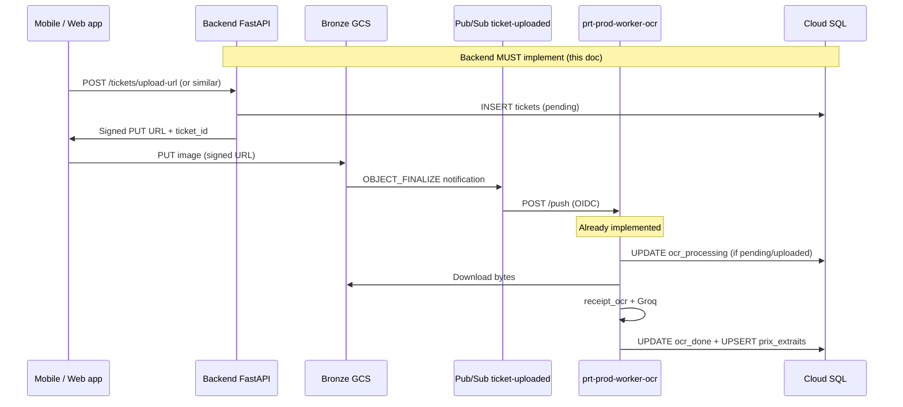

# Backend & platform handoff — OCR worker deployment readiness

**Audience:** Backend team (FastAPI / Phase 7) **and** whoever applies Terraform / Cloud Build (often the same squad or a designated DevOps).  
**Goal:** End-to-end receipt upload → OCR → Cloud SQL, with **`prt-prod-worker-ocr` running the real container** on GCP (not the Phase 5 skeleton).  
**Status:**

| Layer | State |
|-------|--------|
| Worker code (`workers/ocr/`) | Implemented (Groq / `receipt_ocr`) |
| GCP event path (GCS → Pub/Sub → push `/push`) | Provisioned (Phase 5) |
| Cloud Run `prt-prod-worker-ocr` | Still on **skeleton** `hello` image — **must be switched** |
| Cloud SQL `tickets` / `prix_extraits` | **Not migrated** — backend Alembic required |
| Backend upload APIs | **Not implemented** |

**Related specs:**

| Document | Role |
|----------|------|
| [`workers/ocr/ocr-worker-contract.md`](../workers/ocr/ocr-worker-contract.md) | Authoritative worker ↔ platform contract |
| [`workers/ocr/dev_ocr_codebase_reference_for_llm.md`](../workers/ocr/dev_ocr_codebase_reference_for_llm.md) | How `receipt_ocr` output is produced (Groq VLM) |
| [`infra/README.md`](../infra/README.md) | GCS bronze, Pub/Sub, Cloud SQL, IAM |
| [`infra/sql/bootstrap_products.sql`](../infra/sql/bootstrap_products.sql) | Existing `products` table (worker OFF) — separate from tickets |
| [`workers/ocr/README.md`](../workers/ocr/README.md) | Docker / Cloud Build commands |
| [`workers/ocr/cloudbuild.yaml`](../workers/ocr/cloudbuild.yaml) | Image build pipeline |

---

## 1. Executive summary

The OCR worker is **event-driven**: when a file lands in GCS under `tickets/raw/`, Pub/Sub pushes to the worker, which runs Groq vision OCR and **updates** Cloud SQL.

The worker **does not**:

- Create the initial `tickets` row (backend does).
- Issue signed upload URLs (backend does).
- Match EANs (Phase 8+ — all lines get `ean = NULL` today).

If backend ships upload URLs without creating `tickets` first, or uses a GCS path that does not match the convention below, OCR will **silently skip** the message (HTTP 204, zero rows updated) or fail with SQL errors.

### Unified go-live checklist

**Backend (application)** — §4–§6:

- [ ] Alembic migration: `ticket_status`, `tickets`, `prix_extraits` (§4); `users` if missing.
- [ ] Signed URL API: `INSERT tickets` (`pending`) **before** returning PUT URL (§6.1).
- [ ] GCS path = `tickets/raw/{user_id}/{ticket_id}.{ext}` stored in `tickets.gcs_object_path` (§5).
- [ ] Read / validate APIs for `ocr_done` → `validated` (§6.3–§6.5).
- [ ] Staging E2E with real receipt image (§11).

**GCP / worker deployment** — §9 (copy-paste Terraform targets):

- [ ] Build & push image `worker-ocr:<git-sha>` to Artifact Registry (§9.2).
- [ ] Add `worker_ocr_image_tag` in `infra/envs/prod/variables.tf` (§9.3).
- [ ] Replace skeleton image on `module.run_worker_ocr` (§9.4).
- [ ] Add `env` + `secret_env` on `run_worker_ocr` (`PRT_*`, `GROQ_API_KEY`) (§9.4–§9.5).
- [ ] Create Secret Manager secret `prt-prod-groq-api-key` + accessor `worker-sa` (§9.5).
- [ ] Set `timeout_seconds = 540`, tune `memory` / `cpu` (§9.6).
- [ ] `terraform apply` + verify `/healthz` and logs (§9.8).
- [ ] Confirm Pub/Sub push still targets `${run_worker_ocr.uri}/push` (already wired — §9.1).

**Order:** Apply DB migrations (backend) **before** switching the worker image, then GCP worker deploy, then full E2E.

---

## 2. System context (what already exists)



**Already provisioned in GCP (Phase 5+):**

| Resource | Detail |
|----------|--------|
| Bronze bucket | `{project_id}-bronze` (e.g. `price-tracker-prod-01-bronze`) |
| GCS notification | Prefix `tickets/raw/`, event `OBJECT_FINALIZE` → topic `ticket-uploaded` |
| Pub/Sub push | `ticket-uploaded-ocr-push` → `prt-prod-worker-ocr` `/push`, OIDC, ack 600s |
| Cloud SQL | `price_tracker` DB, user `pt_app`, private IP via VPC |
| Table `products` | Populated by worker OFF (EAN catalogue) — **not** receipt lines |

---

## 3. Division of responsibilities

| Responsibility | Owner | Notes |
|----------------|-------|-------|
| Firebase Auth / user identity | Backend | `users.id` must match authenticated user |
| Signed URL for upload | Backend | PUT to bronze; path convention §5 |
| `INSERT tickets` (`pending`) | Backend | **Before** client uploads |
| GCS upload | Client | Direct to bronze |
| OCR + parse receipt | Worker OCR | Groq via `receipt_ocr` |
| `UPDATE tickets` (processing / done / failed) | Worker OCR | Never INSERT tickets |
| `INSERT` / `UPSERT prix_extraits` | Worker OCR | Idempotent on `(ticket_id, line_index)` |
| EAN / embedding match | Future worker phase | Today: `ean = NULL`, `match_method = 'none'` |
| User validation UI + API | Backend | After `ocr_done` |
| `product_aliases` | Future (EAN phase) | Defined in contract; worker does not write yet |
| Cloud Run image + env + secrets | Platform / Terraform | §9 — mirror `run_worker_off` |
| Groq API key in Secret Manager | Platform | Not a `PRT_*` variable |
| Pub/Sub subscription / GCS notification | Already in infra | §9.1 — verify only |

---

## 4. Database schema (Alembic)

Align **exactly** with these names and types so `workers/ocr/pricetracker_ocr/pg.py` works without changes.

The worker integration tests use this DDL: `workers/ocr/tests/test_pg.py`.

### 4.1 Prerequisite: `users`

`tickets.user_id` references `users(id)`. If Phase 7 auth already defines `users`, reuse it. Minimal shape if you are bootstrapping:

```sql
CREATE TABLE IF NOT EXISTS users (
  id         uuid PRIMARY KEY,
  -- add auth fields per your Firebase / JWT design (email, firebase_uid, etc.)
  created_at timestamptz NOT NULL DEFAULT now()
);
```

### 4.2 Enum `ticket_status`

```sql
CREATE TYPE ticket_status AS ENUM (
  'pending',         -- upload URL issued, file not in GCS yet (or not finalized)
  'uploaded',        -- optional: file seen in GCS, OCR not started
  'ocr_processing',  -- worker claimed the job
  'ocr_done',        -- OCR finished; awaiting user validation
  'ocr_failed',      -- permanent OCR failure (see error_message)
  'validated'        -- user confirmed line items
);
```

Use a migration-safe pattern in PostgreSQL if the enum may already exist in dev DBs.

### 4.3 Table `tickets`

```sql
CREATE TABLE tickets (
  id              uuid PRIMARY KEY,
  user_id         uuid NOT NULL REFERENCES users(id),
  gcs_object_path text NOT NULL UNIQUE,
  status          ticket_status NOT NULL DEFAULT 'pending',
  enseigne        text,
  ticket_date     date,
  total_amount    numeric(10,2),
  ocr_confidence  real,
  ocr_engine      text,
  ocr_duration_ms integer,
  error_message   text,
  created_at      timestamptz NOT NULL DEFAULT now(),
  updated_at      timestamptz NOT NULL DEFAULT now()
);

CREATE INDEX tickets_user_id_idx ON tickets (user_id);
CREATE INDEX tickets_status_idx ON tickets (status);
```

**Columns written by OCR worker on success** (`set_ticket_done`):

| Column | Source |
|--------|--------|
| `enseigne` | OCR `ticket.chaine_supermarche` |
| `ticket_date` | OCR `ticket.date` parsed from `yyyyMMdd HH:mm` → `date` |
| `total_amount` | Sum of `unit_price × quantity` over lines (worker mapper) |
| `ocr_confidence` | Placeholder `1.0` until library exposes a score |
| `ocr_engine` | Env `PRT_OCR_ENGINE` (e.g. `groq`) |
| `ocr_duration_ms` | Wall time of OCR step |

**Columns written by OCR worker on failure** (`set_ticket_failed`):

| Column | Value |
|--------|--------|
| `status` | `ocr_failed` |
| `error_message` | Error string (truncation recommended in UI, not in worker today) |

### 4.4 Table `prix_extraits`

```sql
CREATE TABLE prix_extraits (
  ticket_id        uuid NOT NULL REFERENCES tickets(id) ON DELETE CASCADE,
  line_index       smallint NOT NULL,
  raw_text         text NOT NULL,
  quantity         numeric(8,3),
  unit_price       numeric(10,2),
  line_total       numeric(10,2),
  ean              text,
  match_method     text,
  match_confidence real,
  needs_validation boolean NOT NULL DEFAULT true,
  validated_by_user boolean NOT NULL DEFAULT false,
  PRIMARY KEY (ticket_id, line_index)
);

CREATE INDEX prix_extraits_ticket_id_idx ON prix_extraits (ticket_id);
```

**Current worker behavior (Phase 8, no EAN):**

| Column | Value |
|--------|--------|
| `ean` | always `NULL` |
| `match_method` | always `'none'` |
| `match_confidence` | always `NULL` |
| `needs_validation` | always `TRUE` |
| `validated_by_user` | always `FALSE` |

**Mapping from OCR JSON** (`receipt_ocr` canonical schema):

| OCR field (`produits[]`) | SQL column |
|--------------------------|------------|
| `nom_produit` | `raw_text` |
| `prix_unitaire_ou_kg` | `unit_price` |
| `unites` | `quantity` |
| (computed) | `line_total` = `unit_price × quantity` |
| (array index) | `line_index` (0-based, only non-empty names) |

Example OCR product object:

```json
{
  "nom_produit": "PAIN COMPLET",
  "prix_unitaire_ou_kg": 1.2,
  "unites": 2
}
```

### 4.5 Table `product_aliases` (optional now)

Defined in [`ocr-worker-contract.md`](../workers/ocr/ocr-worker-contract.md) §6.3 for future EAN matching. **No worker writes today.** Backend can defer until EAN phase.

### 4.6 Alembic notes

- Baseline: `products` may already exist via [`bootstrap_products.sql`](../infra/sql/bootstrap_products.sql). New revision adds tickets domain only.
- Recommend `alembic stamp` after one-shot SQL in dev if you mirror OFF bootstrap style.
- **Apply migrations on prod before OCR worker goes live.**

---

## 5. GCS path convention (critical)

The worker derives `ticket_id` from the object path with this regex:

```text
^tickets/raw/[^/]+/([0-9a-fA-F-]{36})\.[a-zA-Z0-9]+$
```

**Required layout:**

```text
tickets/raw/{user_id}/{ticket_id}.{extension}
```

| Segment | Rule |
|---------|------|
| `user_id` | UUID string of the owner (must match `tickets.user_id`) |
| `ticket_id` | UUID string = `tickets.id` (generate server-side, v4 recommended) |
| `extension` | Lowercase extension allowed by regex, e.g. `jpg`, `jpeg`, `png`, `webp` |

**Examples (valid):**

```text
tickets/raw/3fa85f64-5717-4562-b3fc-2c963f66afa6/550e8400-e29b-41d4-a716-446655440000.jpg
```

**Invalid (worker returns 400 or wrong id):**

```text
tickets/550e8400-e29b-41d4-a716-446655440000.jpg          # missing raw/{user_id}
uploads/user/550e8400-e29b-41d4-a716-446655440000.jpg   # wrong prefix
```

Store the full path in `tickets.gcs_object_path` **exactly** as GCS will receive it (POSIX-style, forward slashes).

**Bucket:** `{GOOGLE_CLOUD_PROJECT}-bronze` (backend SA has `objectAdmin` on bronze per infra).

---

## 6. Backend APIs to implement

Exact routes are up to your API design; behavior is normative.

### 6.1 Create upload session — signed URL

**Suggested:** `POST /api/v1/tickets/upload-url` (authenticated)

**Request (example):**

```json
{
  "content_type": "image/jpeg",
  "file_extension": "jpg"
}
```

**Server-side steps (order matters):**

1. Resolve `user_id` from JWT / Firebase (must exist in `users`).
2. Generate `ticket_id = uuid4()`.
3. Build `gcs_object_path = f"tickets/raw/{user_id}/{ticket_id}.{ext}"`.
4. **`INSERT INTO tickets`** with:
   - `id = ticket_id`
   - `user_id = user_id`
   - `gcs_object_path = gcs_object_path`
   - `status = 'pending'`
5. Generate **V4 signed URL** for `PUT` on `gs://{bronze_bucket}/{gcs_object_path}` (content-type, short TTL e.g. 15 min).
6. Return to client:

```json
{
  "ticket_id": "550e8400-e29b-41d4-a716-446655440000",
  "upload_url": "https://storage.googleapis.com/...",
  "gcs_object_path": "tickets/raw/.../....jpg",
  "expires_at": "2026-05-25T16:00:00Z"
}
```

**Failure modes to handle:**

- DB insert conflict on `gcs_object_path` → 409
- User not in `users` → 404 or 403 per your auth model

### 6.2 Optional: mark upload complete

Not required for OCR today (worker accepts `pending`). Recommended for clearer UX:

**Suggested:** `POST /api/v1/tickets/{ticket_id}/uploaded`

- Verify ticket belongs to caller.
- `UPDATE tickets SET status = 'uploaded', updated_at = now() WHERE id = $1 AND status = 'pending'`.

If omitted, OCR still runs when GCS notification fires while status is `pending`.

### 6.3 Poll ticket status

**Suggested:** `GET /api/v1/tickets/{ticket_id}`

Return `status`, `enseigne`, `ticket_date`, `total_amount`, `ocr_confidence`, `error_message`, timestamps.

| `status` | Meaning for UI |
|----------|----------------|
| `pending` | Waiting for upload or GCS finalize |
| `uploaded` | File received, OCR queued |
| `ocr_processing` | Worker running |
| `ocr_done` | Show line items for validation |
| `ocr_failed` | Show `error_message`, offer re-upload |
| `validated` | Confirmed by user |

### 6.4 List line items (after OCR)

**Suggested:** `GET /api/v1/tickets/{ticket_id}/lines`

Query `prix_extraits` where `ticket_id = $1` ordered by `line_index`.

**Response shape (example):**

```json
{
  "lines": [
    {
      "line_index": 0,
      "raw_text": "PAIN COMPLET",
      "quantity": 2.0,
      "unit_price": 1.2,
      "line_total": 2.4,
      "ean": null,
      "needs_validation": true
    }
  ]
}
```

Only expose tickets owned by the authenticated `user_id`.

### 6.5 User validation

After user edits/confirms lines:

**Suggested:** `POST /api/v1/tickets/{ticket_id}/validate`

- Update `prix_extraits` rows (quantities, labels if allowed).
- Set `validated_by_user = true` on lines (or subset).
- `UPDATE tickets SET status = 'validated', updated_at = now()`.

Do **not** delete `prix_extraits` on re-validation without a product decision — worker UPSERT is idempotent on replay only for same indices.

---

## 7. Ticket status lifecycle

```text
                    ┌─────────────┐
                    │   pending   │  ← Backend INSERT (signed URL)
                    └──────┬──────┘
                           │ optional: backend POST uploaded
                           ▼
                    ┌─────────────┐
         ┌─────────│  uploaded   │─────────┐
         │         └──────┬──────┘         │
         │ GCS+Pub/Sub    │                │
         ▼                ▼                │
  ┌──────────────┐  (worker also accepts pending)
  │ocr_processing│  ← Worker UPDATE
  └──────┬───────┘
         │
    ┌────┴────┐
    ▼         ▼
┌─────────┐ ┌───────────┐
│ocr_done │ │ocr_failed │  ← Worker UPDATE
└────┬────┘ └───────────┘
     │ user validates
     ▼
┌───────────┐
│ validated │  ← Backend UPDATE
└───────────┘
```

**Worker claim query** (do not change statuses outside this set for claim):

```sql
UPDATE tickets SET status = 'ocr_processing', updated_at = now()
WHERE id = $1::uuid AND status IN ('pending', 'uploaded');
```

If status is already `ocr_processing`, `ocr_done`, `ocr_failed`, or `validated`, the worker returns **204** and does nothing (idempotent Pub/Sub replay).

---

## 8. OCR output schema (for API design)

The worker uses library output from `extract_receipt()`:

```json
{
  "ticket": {
    "date": "20240315 14:30",
    "chaine_supermarche": "CARREFOUR MARKET",
    "adresse": "1 rue Example, 75001 Paris",
    "produits": [
      {
        "nom_produit": "PAIN COMPLET",
        "prix_unitaire_ou_kg": 1.2,
        "unites": 2
      }
    ]
  }
}
```

- `date`: empty string allowed → `ticket_date` NULL in DB.
- `adresse`: OCR fills it; **not stored** on `tickets` today (only `enseigne`, `ticket_date`, `total_amount`). Add a column later if product needs it.
- Do not confuse with example files under repo `data/ocr_output_example_*.json` — those use different key names and are **not** the worker schema.

---

## 9. GCP worker deployment (platform / Terraform)

This section is the **worker-side** complement to backend work. Today `infra/envs/prod/cloud_run.tf` deploys `prt-prod-worker-ocr` with Google's placeholder image — Pub/Sub push succeeds but **no OCR runs**. Backend teams need this context to plan go-live and to request the right Terraform apply from whoever owns `infra/`.

### 9.1 What is already provisioned (no action unless broken)

These resources exist from Phase 5 and do **not** need re-creation when shipping the real worker:

| Resource | Config | File |
|----------|--------|------|
| Cloud Run service | `prt-prod-worker-ocr`, SA `prt-prod-worker-sa`, ingress `INTERNAL_LOAD_BALANCER`, VPC egress `PRIVATE_RANGES_ONLY` | `infra/envs/prod/cloud_run.tf` |
| IAM | `worker-sa` has `roles/run.invoker` on worker-ocr (for Pub/Sub OIDC push) | `cloud_run.tf` |
| GCS notification | `OBJECT_FINALIZE` on `{project}-bronze`, prefix `tickets/raw/` → topic `ticket-uploaded` | `notifications.tf` |
| Pub/Sub push sub | `ticket-uploaded-ocr-push` → `{service.uri}/push`, OIDC audience = service URI, ack **600s**, DLQ after 5 failures | `subscriptions.tf` |
| Bronze bucket IAM | `worker-sa`: read objects (`objectViewer`); backend: `objectAdmin` for signed PUT | `storage.tf`, `infra/README.md` |
| Cloud SQL access | `worker-sa`: `cloudsql.client` + password secret `prt-prod-cloudsql-password` (shared with backend) | Phase 4 IAM |

**Network note:** `PRIVATE_RANGES_ONLY` routes only RFC1918 traffic through the VPC (Cloud SQL private IP). **Outbound calls to Groq's public API** use Cloud Run's default internet path — no change needed for Groq.

**Endpoints exposed by the real worker** (must match push subscription):

| Method | Path | Auth |
|--------|------|------|
| `GET` | `/healthz` | None |
| `POST` | `/push` | OIDC bearer (`prt-prod-worker-sa`) |

### 9.2 Build and push the container image

The image bundles `workers/ocr` **and** installs `receipt_ocr` from `dev_ocr/`. Build context must be the **monorepo root** (not `workers/ocr/` alone).

```bash
# From repository root
export PROJECT_ID=price-tracker-prod-01
export SHORT_SHA=$(git rev-parse --short HEAD)

gcloud builds submit . \
  --project="$PROJECT_ID" \
  --config=workers/ocr/cloudbuild.yaml \
  --substitutions=_SHORT_SHA="$SHORT_SHA"
```

Resulting image:

```text
europe-west1-docker.pkg.dev/price-tracker-prod-01/prt-prod-docker/worker-ocr:<SHORT_SHA>
```

Local smoke build (optional):

```bash
docker build -f workers/ocr/Dockerfile -t worker-ocr:local .
```

**Do not** embed PaddleOCR weights in the image — Groq path has no local model. Classical engines (`PRT_OCR_ENGINE=paddleocr`) would need separate ops work.

### 9.3 Terraform variable — image tag

Add to `infra/envs/prod/variables.tf` (same pattern as `worker_off_image_tag`):

```hcl
variable "worker_ocr_image_tag" {
  description = "Tag of worker-ocr image in Artifact Registry. Must exist before apply."
  type        = string
  default     = "REPLACE_WITH_SHORT_SHA"  # e.g. abc1234 after first build
}
```

Bump this tag after every worker release you want on Cloud Run.

### 9.4 Terraform — replace `module.run_worker_ocr`

**Current (skeleton):**

```hcl
image = local.cloud_run_skeleton_image  # us-docker.pkg.dev/cloudrun/container/hello
```

**Target:** mirror `module.run_worker_off` in the same file — replace the whole `run_worker_ocr` block with:

```hcl
module "run_worker_ocr" {
  source = "../../modules/cloud_run"

  project_id            = var.project_id
  region                = var.region
  name                  = "${var.name_prefix}-worker-ocr"
  image                 = "${module.artifact_registry.docker_registry_url}/worker-ocr:${var.worker_ocr_image_tag}"
  service_account_email = module.iam.emails["worker"]

  min_instances   = 0
  max_instances   = 5
  cpu             = "1"
  memory          = "1Gi"              # Groq: no local model; 512Mi may suffice — start 1Gi
  timeout_seconds = 540                # < Pub/Sub ack_deadline 600s (contract)

  vpc_subnet = local.cloud_run_subnet
  vpc_egress = "PRIVATE_RANGES_ONLY"
  ingress    = "INGRESS_TRAFFIC_INTERNAL_LOAD_BALANCER"

  env = {
    GOOGLE_CLOUD_PROJECT = var.project_id
    PRT_GCP_REGION       = var.region
    PRT_BRONZE_BUCKET    = "${var.project_id}-bronze"
    PRT_OCR_ENGINE       = "groq"

    PRT_PG_HOST      = module.cloud_sql_main.private_ip_address
    PRT_PG_PORT      = "5432"
    PRT_PG_DB        = module.cloud_sql_main.db_name
    PRT_PG_USER      = module.cloud_sql_main.db_user
    PRT_PG_POOL_SIZE = "4"

    # Pub/Sub OIDC: allowlist worker SA (same pattern as worker-off)
    PRT_OIDC_ALLOWED_SERVICE_ACCOUNTS = module.iam.emails["worker"]
    PRT_LOG_LEVEL                     = "INFO"
  }

  secret_env = {
    PRT_PG_PASSWORD = {
      secret  = module.secrets.secret_ids["${var.name_prefix}-cloudsql-password"]
      version = "latest"
    }
    GROQ_API_KEY = {
      secret  = module.secrets.secret_ids["${var.name_prefix}-groq-api-key"]
      version = "latest"
    }
  }

  labels = merge(var.labels, { component = "worker-ocr" })
}
```

**Mapping to worker code:** `pricetracker_ocr/config.py` reads these `PRT_*` names (case-insensitive). `GROQ_API_KEY` is read by `receipt_ocr` / `GroqProvider`, not via `Settings`.

### 9.5 Secret Manager — Groq API key

Add to `infra/envs/prod/secret_manager.tf` inside `module.secrets` → `secrets`:

```hcl
"${var.name_prefix}-groq-api-key" = {
  description = "Groq API key for worker-ocr (Llama 4 Scout vision). Populated manually."
  accessors   = [local.worker_sa]
}
```

After `terraform apply` creates the empty secret, **add the secret value once** (never commit the key):

```bash
echo -n "YOUR_GROQ_API_KEY" | gcloud secrets versions add prt-prod-groq-api-key \
  --project=price-tracker-prod-01 \
  --data-file=-
```

Legacy name `groq_key` is also supported by `receipt_ocr` locally, but Cloud Run should use **`GROQ_API_KEY`** via `secret_env` above.

### 9.6 Cloud Run sizing (Groq path)

| Setting | Contract / recommendation | Current skeleton |
|---------|---------------------------|------------------|
| `timeout_seconds` | **540** (under ack 600s) | 300 (module default) |
| `memory` | **512Mi–1Gi** (no Paddle weights) | 512Mi |
| `cpu` | **1** (I/O + Groq latency) | 1 |
| `max_instances` | **5** (parallel uploads) | 5 |

If you later switch `PRT_OCR_ENGINE` to `paddleocr`, revisit memory (contract suggests ~2Gi) and model download to `/tmp`.

### 9.7 IAM and access the worker does **not** need

| Access | Worker OCR (Groq) | Notes |
|--------|-------------------|-------|
| BigQuery | **No** | Contract forbids |
| Vertex AI | **No** | EAN phase later |
| GCS bronze | **Read** | Download receipt bytes |
| Cloud SQL | **Read/write** | `tickets`, `prix_extraits` only |
| Groq HTTPS API | **Yes** | Public internet |
| Artifact Registry | **No** at runtime | Image baked at deploy |

`prt-prod-worker-sa` already has the right broad IAM from Phase 2/4; no new SA required.

### 9.8 Verify deployment

```bash
PROJECT=price-tracker-prod-01
REGION=europe-west1
SERVICE=prt-prod-worker-ocr

# Service URL (internal — use from VPC or Cloud Shell with auth)
gcloud run services describe "$SERVICE" \
  --project="$PROJECT" --region="$REGION" \
  --format='value(status.url)'

# Health (requires authenticated invoke or bypass in dev only)
curl -H "Authorization: Bearer $(gcloud auth print-identity-token)" \
  "$(gcloud run services describe $SERVICE --region=$REGION --project=$PROJECT --format='value(status.url)')/healthz"
# Expected: {"status":"ok"}

# Logs after a test upload
gcloud logging read \
  'resource.type="cloud_run_revision" AND resource.labels.service_name="prt-prod-worker-ocr"' \
  --project="$PROJECT" --limit=50 --format=json
```

Look for structured JSON events: `push_received`, `ocr_start`, `ocr_done`, `ocr_failed`, `pg_upsert_done` (all include `ticket_id`).

**DLQ:** subscription `ticket-uploaded-dlq` / pull sub `ticket-uploaded-dlq-inspection` — inspect if messages retry 5× (infra 5xx) vs land in DLQ.

### 9.9 What breaks if only the image is swapped

| Missing piece | Symptom |
|---------------|---------|
| No `env` / wrong `PRT_BRONZE_BUCKET` | GCS download fails → 5xx → Pub/Sub retries |
| No `PRT_PG_*` / password secret | DB pool fails at startup or first `/push` → 5xx |
| No `GROQ_API_KEY` | `OcrProcessingError` → `ocr_failed`, HTTP **204** (ACK, no DLQ) |
| No `tickets` table | SQL error → likely 5xx |
| No `tickets` row before upload | 204 skip, no OCR (silent) |
| `PRT_OIDC_ALLOWED_SERVICE_ACCOUNTS` empty | 401/403 on `/push` → Pub/Sub retries |

### 9.10 Deployment order (full stack)

| Step | Owner | Action |
|------|-------|--------|
| 1 | Backend | Alembic on dev → staging → prod |
| 2 | Backend | Upload APIs on staging |
| 3 | Platform | Build/push `worker-ocr:$SHA` |
| 4 | Platform | Terraform: secret + `run_worker_ocr` env/image + apply |
| 5 | Platform | Populate `prt-prod-groq-api-key` secret version |
| 6 | QA | E2E §11 on staging/prod |

---

## 10. E2E test script (staging)

Minimal manual test for backend QA:

1. Authenticate as test user (exists in `users`).
2. `POST /tickets/upload-url` → save `ticket_id`, `upload_url`.
3. `PUT` a real receipt JPEG to `upload_url` (curl or app).
4. Wait 10–60 s (Groq latency + cold start).
5. `GET /tickets/{ticket_id}` until `status = ocr_done` (or `ocr_failed`).
6. `GET /tickets/{ticket_id}/lines` → expect ≥1 line with `raw_text`, prices.
7. Replay: same Pub/Sub message must not duplicate lines (`ON CONFLICT` on `prix_extraits`).

**SQL sanity checks:**

```sql
SELECT id, status, enseigne, ticket_date, total_amount, error_message
FROM tickets WHERE id = '<ticket_id>';

SELECT line_index, raw_text, quantity, unit_price, line_total, ean, match_method
FROM prix_extraits WHERE ticket_id = '<ticket_id>' ORDER BY line_index;
```

---

## 11. Failure scenarios (backend UX)

| Symptom | Likely cause | Backend action |
|---------|--------------|----------------|
| Stuck `pending` forever | Client never uploaded | Show expiry; allow new upload URL |
| `ocr_failed` | Bad image, Groq error, parse error | Show `error_message`; new ticket upload |
| Stuck `pending` after upload | No `tickets` row or path mismatch | Fix §5 path; ensure INSERT before PUT |
| Empty `prix_extraits` but `ocr_done` | Blank receipt / OCR found no products | Rare; show empty state |
| 204 from worker, no OCR | No row or status not in (`pending`,`uploaded`) | Check `ticket_id` vs filename UUID |

Worker marks **non-retryable** errors as `ocr_failed` and ACKs Pub/Sub (204) so messages do not poison the DLQ.

---

## 12. Security & authorization

- Only the **owner** (`tickets.user_id`) should read or validate a ticket.
- Signed URLs must be **scoped** to one object path; short TTL; PUT only.
- Do not expose `error_message` or other users’ tickets across accounts.
- Backend uses **ADC** / SA for GCS signing (no JSON key files — org policy).

Worker `/push` is **not** called by the mobile app — only Pub/Sub with OIDC from `prt-prod-worker-sa`.

---

## 13. Out of scope (this phase)

| Item | Owner / when |
|------|----------------|
| Vertex embeddings, EAN match, `product_aliases` | Future worker phase |
| Modifying `workers/ocr/` or `dev_ocr` (unless OCR bugfix) | OCR dev team |
| Recreating Pub/Sub / GCS notifications | Already done — §9.1 |
| Backend implementing Groq calls directly | Worker only |

Backend **does not** apply Terraform, but must **coordinate** on §9 timing and secrets.

---

## 14. Open questions for product / backend lead

Record decisions here when resolved:

| # | Question | Default recommendation |
|---|----------|------------------------|
| 1 | Store `adresse` on `tickets`? | Add `adresse text` column if UI shows store address |
| 2 | Who sets `uploaded`? | Optional backend endpoint; not blocking OCR |
| 3 | Re-upload same `ticket_id`? | New ticket row + new UUID; do not overwrite GCS path in place |
| 4 | Max image size | Worker rejects >10 MB at GCS download; align signed URL policy |
| 5 | Supported MIME/types | `jpg`, `png`, `webp` per path regex |

---

## 15. Contact / code pointers

| Need | Location |
|------|----------|
| Worker SQL writes | `workers/ocr/pricetracker_ocr/pg.py` |
| Path parsing | `workers/ocr/pricetracker_ocr/pubsub.py` |
| OCR → SQL mapping | `workers/ocr/pricetracker_ocr/mapper.py` |
| Worker settings (env names) | `workers/ocr/pricetracker_ocr/config.py` |
| Contract §6 DDL + HTTP | `workers/ocr/ocr-worker-contract.md` |
| Terraform OCR service (today skeleton) | `infra/envs/prod/cloud_run.tf` |
| Pub/Sub push sub | `infra/envs/prod/subscriptions.tf` |
| GCS → Pub/Sub | `infra/envs/prod/notifications.tf` |
| Secrets module | `infra/envs/prod/secret_manager.tf` |
| Changelog entries | `dev_ocr/documentation.md` (Entries 9–10) |

---

*Document version: 2026-05-26 — backend APIs + GCP worker deployment (Terraform targets in §9).*
